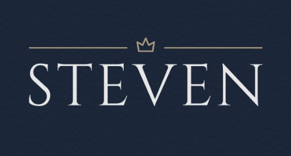

# BIENVENIDO A MI PERFIL
___
<html>
  

  
    

</html>
<h3> Mi nombre es Estevan y soy estudiante de la universidad de las fuerzas armadas ESPE "sede latacunga</h3>
<HTML>

  

  

<h3 align="left">Connect with me:</h3>

<h3 align="left">Languages and Tools:</h3>

        

&nbsp;

  </html>
